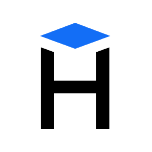

<!-- Hexlet logo -->
<a id="anchor-top"></a>
<div align="center"
      style="display: flex; flex-wrap: wrap; flex: 1; flex-direction: column; margin: 0">
  <a href="https://ru.hexlet.io/" style="color: black">
     
  </a>
  <p style="display: flex; flex-wrap: wrap; flex: 1; justify-content: center; margin: 0">hands-on programming courses</p>
</div>

### Hexlet tests and linter status:
[](https://github.com/bazarovstas/python-project-49/actions)
[](https://codeclimate.com/github/bazarovstas/python-project-49/maintainability)


<!-- Main page -->
[![Hexlet-Project][project-image]](https://ru.hexlet.io/)


## Table of contents  
**[The Brain Games](#the-brain-games)**  
**[The Even Game](#the-brain-even)**  
**[The Calc Game](#the-calc-game)**  
**[The GCD Game](#the-gcd-game)**  
**[The Progressive Game](#the-progressive-game)**  
**[The Prime Game](#the-prime-game)**  
**[Tech Stack](#tech-stack)**    
**[Installation](#installation)**    
**[Usage](#usage)**    
**[Reinstall](#reinstall)**    


# The Brain Games  
Brain Games is a set of 5 logic puzzles that let you test how smart you are:

|Game|Question|Example|
|---|---|--:| 
| The Even Game | Answer "yes" if the number is even, otherwise answer "no" | 44 |
| The Calc Game | What is the result of the expression? | 7 + 11 |
| The GCD Game | Find the greatest common divisor of given numbers | 10 90 |  
| The Progressive Game | What number is missing in the progression? | 3 7 .. 15 |
| The Prime Game | Answer "yes" if given number is prime. Otherwise answer "no" | 21 |

<p align="right">[<a href="#anchor-top" style="color: black">BACK TO TOP</a>]</p>

## The Even Game  
This demo of the even game shows the game process:  
[](https://asciinema.org/a/687407)

<p align="right">[<a href="#anchor-top" style="color: black">BACK TO TOP</a>]</p>

## The Calc Game
This demo of the calc game shows the game process:  
[](https://asciinema.org/a/687410)

<p align="right">[<a href="#anchor-top" style="color: black">BACK TO TOP</a>]</p>

## The GCD Game
This demo of the gcd game shows the game process:  
[](https://asciinema.org/a/687411)

<p align="right">[<a href="#anchor-top" style="color: black">BACK TO TOP</a>]</p>

## The Progressive Game
This demo of the progressive game shows the game process:  
[](https://asciinema.org/a/687412)

<p align="right">[<a href="#anchor-top" style="color: black">BACK TO TOP</a>]</p>

## The Prime Game
This demo of the prime game shows the game process:  
[](https://asciinema.org/a/687413)

<p align="right">[<a href="#anchor-top" style="color: black">BACK TO TOP</a>]</p>


## Tech Stack  


<p align="right">[<a href="#anchor-top" style="color: black">BACK TO TOP</a>]</p>

## Installation
The installation is simple and does not take much time

**1. Installing pipx**

If you don't have a python 3.8+ than is required to install pipx:  
  * Ubuntu:  
  ```
  sudo apt install pipx
  ```
  * Using pip:
  ```
  python3 -m pip install --user pipx
  ```
  * Or on Windows via Scoop:  
  ```
  scoop install pipx
  ```

**2. Install Poetry**

If pipx is already installed, you can install poetry:
  ```
  pipx install poetry
  ```
  add pyproject.toml to project folder:
  ```
  poetry new project_name
  ```
  or in pre-populated directory:
  ```
  poetry init
  ```
  and the last thing in this step, install virtual environment:
  ```
  poetry install
  ```

**3. Repository**

Visit GitHub at the following link: https://github.com/bazarovstas/python-project-49  
and finnaly, enter the following command in the CLI:
  ```
  poetry add git+ssh://git@github.com:bazarovstas/python-project-49.git
  ```

<p align="right">[<a href="#anchor-top" style="color: black">BACK TO TOP</a>]</p>

## Usage  
you can use scripts from the Makefile by installing the package, or use poetry scripts without installing anything:
  * Poetry:  
  ```
  poetry run brain-even
  poetry run brain-calc
  poetry run brain-gcd
  poetry run brain-progression
  poetry run brain-prime
  ```
  * Scripts:  
generate a distributive and install them:
  ```
  make build
  make package-install
  ```
  use one of the following commands to run a specific game:  
  ```
  brain-even
  brain-calc
  brain-gcd
  brain-progression
  brain-prime
  ```

<p align="right">[<a href="#anchor-top" style="color: black">BACK TO TOP</a>]</p>

## Reinstall  
  to reinstall the package, use the following command:  
  ```
  package-reinstall
  ```

<p align="right">[<a href="#anchor-top" style="color: black">BACK TO TOP</a>]</p>

<div align="center"
      style="display: flex; flex-wrap: wrap; flex: 1; flex-direction: column; margin: 0">
  <a href="https://ru.hexlet.io/" style="color: black">
     
  </a>
</div>


<!-- Markdown images -->
[project-image]: images/project_image.png
